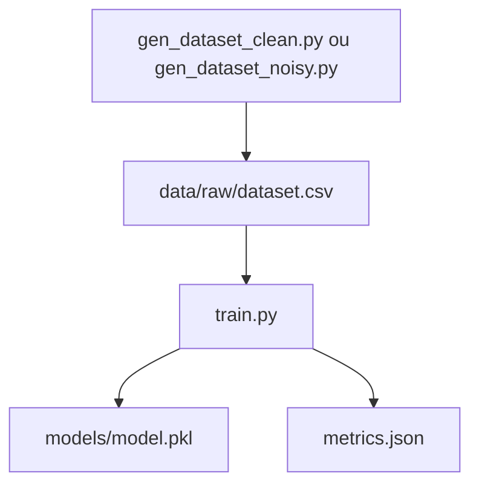

# dvc-mini-pipeline


Mini projet démonstratif pour comprendre **comment structurer et versionner un pipeline de machine learning** avec [DVC](https://dvc.org).

> 🔎 Objectif : explorer les bonnes pratiques de tracking des datasets, des modèles et des métriques dans un projet ML reproductible.

---

## 🎯 Pour qui ?
Ce projet est fait pour toi si tu es :
- Data scientist / ML engineer débutant ou intermédiaire
- En train d'apprendre à structurer tes projets de manière propre et reproductible
- Curieux de voir comment DVC s'intègre dans un workflow ML minimal

---

## 🧠 Ce que tu vas apprendre
- Gérer des **datasets versionnés** avec DVC
- Construire un pipeline ML simple avec **des étapes traçables**
- Comparer les performances entre différents runs (ex. données bruitées vs propres)
- Automatiser ton workflow avec **Makefile**

---

## 🧬 Le pipeline ML en bref



Le pipeline a une seule étape `train`, qui prend en entrée un dataset, entraîne un modèle (RandomForestClassifier), puis écrit les **métriques d’accuracy** dans `metrics.json`.

---

## ⚡️ Installation rapide

```bash
git clone https://github.com/martinezcoralie/dvc-mini-pipeline.git
cd dvc-mini-pipeline
make venv
```

---

## 📂 Structure du projet

```bash
.
├── data/          # Données versionnées par DVC
├── models/        # Modèles entraînés
├── scripts/       # Scripts exécutables (data generation, train)
├── src/           # Code métier (utils etc.)
├── dvc.yaml       # Définition du pipeline
├── metrics.json   # Fichier de métriques suivi par DVC
├── Makefile       # Pour tout automatiser
```

---

## 🧪 Comment l'utiliser

1. **Initialiser DVC**
```bash
make init_dvc
```

2. **Générer un dataset et lancer le pipeline**
```bash
make clean_dataset && make run_pipeline && make tag_clean SUFFIX=v1   # dataset propre
make noisy_dataset && make run_pipeline && make tag_noisy SUFFIX=v1  # dataset bruité
```

3. **Comparer les métriques sur plusieurs commits**
```bash
make metrics
```

Exemple d’output :
```bash
Revision         Path           accuracy
f30ab6b (clean)  metrics.json   0.89
dc9bc60 (noisy)  metrics.json   0.74
```

4. **Réinitialiser complètement**
```bash
make clean
make reset_dvc
```

---

## 📚 Documentation complète

➡️ Voir le tutoriel étape par étape dans [`docs/README.md`](docs/README.md)
